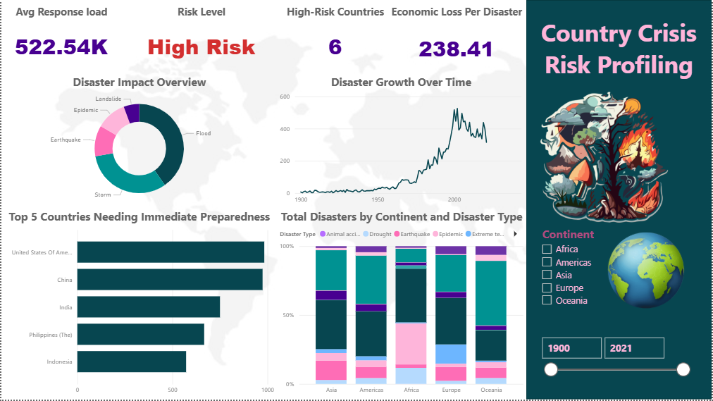

# 🌍 Country Crisis Risk Profiling

## 📌 Overview

This project analyzes global natural disaster events from **1900 to 2021** using historical EM-DAT data.

The goal is to identify disaster trends, high-risk regions, and crisis patterns to support data-driven decision making.

---

## 🎯 Objectives

- Analyze historical disaster records
- Identify countries with the highest disaster frequency
- Explore disaster trends over time
- Build interactive Power BI dashboards
- Support crisis risk assessment

---

## 🛠️ Technologies


---

## 📂 Project Structure

```text
├── README.md
├── emdat-disasters-1900-2021.xlsx
├── data-preprocessing.ipynb
├── analysis-queries.sql
├── country-crisis-dashboard.pbix
├── Country-Crisis-Risk-Profiling.pdf
└── dashboard.png
```

---

## 🚀 Getting Started

1. Clone the repository.
2. Open the Jupyter Notebook.
3. Install the required Python libraries.
4. Explore the Power BI dashboard.

---


## 📊 Dashboard


---

## 📈 Key Insights

- Identified countries with the highest disaster occurrence
- Analyzed disaster trends across different decades
- Compared disaster categories and affected regions
- Built interactive visualizations for risk profiling


Artificial Intelligence Graduate
